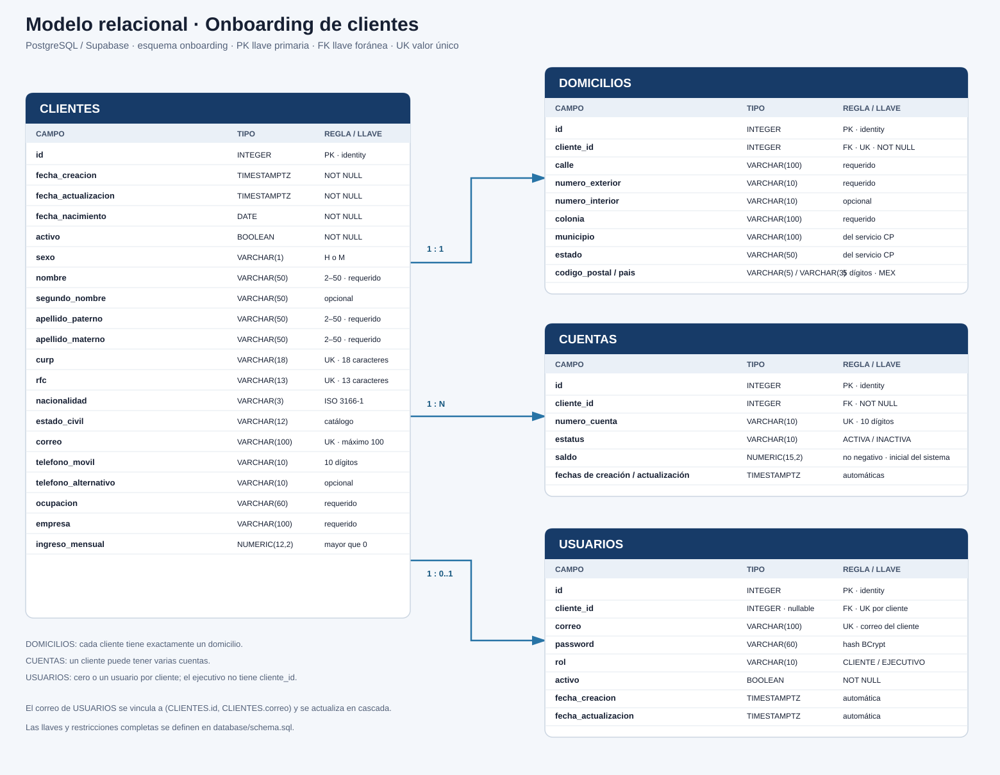

# API de onboarding de clientes

API REST para registrar personas físicas, administrar su domicilio, crear cuentas bancarias y gestionar el acceso mediante JWT. El proyecto también integra la consulta de códigos postales de México y el catálogo de productos de GestoPago.

## Tecnologías

- Java 17 y Spring Boot 3.3.6.
- Spring Web, Validation, Data JPA/Hibernate y Spring Security.
- PostgreSQL en Supabase para datos relacionales y MongoDB para el catálogo de productos.
- Flyway para migraciones SQL.
- BCrypt para almacenar contraseñas y JWT HS256 para autenticar peticiones.
- OpenAPI/Swagger UI.

## Arquitectura

Los controladores exponen la API; los servicios contienen las reglas de negocio; los repositorios acceden a PostgreSQL con JPA; las entidades representan el modelo persistente. Clientes, domicilios, cuentas y usuarios se encuentran en el esquema `onboarding` de PostgreSQL. Las migraciones se encuentran en `src/main/resources/db/migration`.

La creación del cliente se realiza en una transacción: registra cliente y domicilio, genera una cuenta con saldo inicial y crea el usuario con contraseña BCrypt. La baja lógica conserva los registros, pero desactiva las cuentas y el usuario asociado.

## Diagrama entidad–relación



`USUARIOS.cliente_id` es nulo únicamente para el usuario de rol `EJECUTIVO`; cada usuario `CLIENTE` está asociado a un único cliente. El correo del usuario cliente se mantiene alineado con el correo del cliente mediante una llave foránea compuesta.

## Base de datos

El script consolidado de creación está en [`database/schema.sql`](database/schema.sql). Reproduce las migraciones V1 a V5 y debe ejecutarse únicamente sobre una base nueva. En la aplicación, Flyway ejecuta las migraciones automáticamente al iniciar; no ejecutes además el script consolidado sobre una base que ya tenga esas migraciones.

La base contiene las tablas heredadas `public.gestopago_tokens` y `public.personas`, además de `onboarding.clientes`, `onboarding.domicilios`, `onboarding.cuentas` y `onboarding.usuarios`. Las llaves, restricciones, índices, secuencia de números de cuenta y valores permitidos están declarados en el SQL.

## Configuración y ejecución local

Configura los valores por variables de entorno (Spring Boot las usa para sobrescribir `application.properties`).

Variables principales:

| Variable | Uso |
|---|---|
| `SPRING_DATASOURCE_URL` | URL JDBC de PostgreSQL/Supabase. |
| `SPRING_DATASOURCE_USERNAME` | Usuario de base de datos. |
| `SPRING_DATASOURCE_PASSWORD` | Contraseña de base de datos. |
| `SPRING_DATA_MONGODB_URI` | URI de MongoDB. |
| `ONBOARDING_JWT_SECRETO` | Llave HS256 codificada en Base64, de al menos 256 bits. |
| `ONBOARDING_EJECUTIVO_CORREO` | Correo del ejecutivo inicial. |
| `ONBOARDING_EJECUTIVO_PASSWORD` | Contraseña inicial del ejecutivo; cumple la política de contraseñas. |

El ejecutivo se crea al arrancar si su correo no existe. Su contraseña se almacena con BCrypt. Si el usuario ya existe, el inicializador no cambia su contraseña.

En PowerShell, establece las variables en la sesión y arranca:

```powershell
$env:SPRING_DATASOURCE_URL = "jdbc:postgresql://HOST:5432/postgres?sslmode=require"
$env:SPRING_DATASOURCE_USERNAME = "USUARIO"
$env:SPRING_DATASOURCE_PASSWORD = "CONTRASENA"
$env:SPRING_DATA_MONGODB_URI = "URI_MONGODB"
$env:ONBOARDING_JWT_SECRETO = "LLAVE_BASE64_DE_32_BYTES_O_MAS"
$env:ONBOARDING_EJECUTIVO_CORREO = "correo-del-ejecutivo"
$env:ONBOARDING_EJECUTIVO_PASSWORD = "CONTRASENA_SEGURA"
./gradlew.bat bootRun
```

Completa los valores entre comillas con los datos de tu entorno. Para Render, configura las mismas variables en **Environment** del servicio. No publiques contraseñas, URI con credenciales ni la llave JWT en capturas o repositorios.

## Swagger y flujo de autenticación

- Aplicación desplegada: [https://pwa-n2mh.onrender.com/](https://pwa-n2mh.onrender.com/)
- Swagger UI desplegado: [https://pwa-n2mh.onrender.com/swagger-ui/index.html](https://pwa-n2mh.onrender.com/swagger-ui/index.html)
- OpenAPI JSON: [https://pwa-n2mh.onrender.com/v3/api-docs](https://pwa-n2mh.onrender.com/v3/api-docs)

Para endpoints protegidos, llama `POST /auth/login` con `{ "correo": "...", "password": "..." }`. Copia el campo `token` de la respuesta y usa **Authorize** en Swagger; pega el JWT (Swagger añade el esquema Bearer). El rol `EJECUTIVO` administra clientes/cuentas/usuarios. El rol `CLIENTE` puede consultar y actualizar sus propios datos y cuentas, sujeto a las reglas del endpoint.

### Credenciales del ejecutivo para Swagger

No existe un endpoint para crear usuarios con rol `EJECUTIVO`. El usuario inicial se crea desde la configuración de la aplicación. Para iniciar sesión en el entorno configurado en `application.properties`, usa:

| Campo | Valor |
|---|---|
| Correo | `ejecutivo@banco.com` |
| Contraseña | `Ejec#rKLGcfVa9a9a` |

En Swagger, abre `POST /auth/login`, envía esas credenciales y copia el valor de `token` de la respuesta. Después pulsa **Authorize**, pega el token y autoriza. Así podrás probar los endpoints que requieren rol ejecutivo, como la consulta global de clientes, creación de cuentas y administración de usuarios. Si la cuenta ejecutiva ya existía en la base de datos con otra contraseña, el inicializador no la reemplaza; en ese caso estas credenciales pueden no coincidir con la cuenta persistida.

## Endpoints principales

| Método | Ruta | Acceso / función |
|---|---|---|
| `POST` | `/auth/login` | Público; inicia sesión y devuelve JWT. |
| `POST` | `/clientes` | Público; registra cliente, domicilio, cuenta y usuario. |
| `GET` | `/clientes` | Ejecutivo; lista paginada y filtra por nombre, apellidos, CURP, RFC, correo, número de cuenta, estatus y fechas. |
| `GET` | `/clientes/{id}` | Ejecutivo o el propio cliente. |
| `PATCH` | `/clientes/{id}` | Ejecutivo o el propio cliente; actualización parcial y baja/reactivación lógica. CURP y RFC son inmutables. |
| `GET` | `/cuentas` | Ejecutivo; filtra por `clienteId` y/o `estatus`. Cliente: debe indicar su `clienteId`. |
| `GET` | `/cuentas/{numeroCuenta}` | Ejecutivo o propietario. |
| `GET` | `/cuentas/{numeroCuenta}/saldo` | Ejecutivo o propietario. |
| `POST` | `/cuentas` | Ejecutivo; crea cuenta para cliente activo. |
| `PATCH` | `/cuentas/{numeroCuenta}` | Ejecutivo; modifica estatus. |
| `GET` | `/usuarios/filtro` | Ejecutivo; filtra por correo, estatus o cliente. |
| `PUT` | `/usuarios/agregar` | Ejecutivo; agrega usuario a cliente activo sin usuario. |
| `GET` | `/codigos-postales/{codigoPostal}` | Público; consulta CP mexicano, estado, municipio y colonias. |
| `GET` | `/productos` | Público; consulta el catálogo de productos externo. |

Las listas usan `pagina` (inicia en 0) y `tamanio` (por defecto 20, máximo 100). El detalle completo de parámetros y modelos está en Swagger.

## Validaciones y manejo de errores

Se validan mayoría de edad, formato de CURP/RFC/correo, unicidad de CURP/RFC/correo, sexo `H` o `M`, teléfono mexicano de 10 dígitos, CP de 5 dígitos y domicilio contra el servicio de códigos postales. Se aplican restricciones SQL, validaciones de Spring y excepciones centralizadas. Las contraseñas requieren mayúscula, minúscula, número, carácter especial y al menos 8 caracteres.

Los errores se devuelven con respuesta JSON mediante `GlobalExceptionHandler` y el manejador de seguridad. La API incluye límites de tamaño del cuerpo, paginación y protección frente a intentos repetidos de autenticación.

## Pruebas y evidencias

Las pruebas unitarias están en `src/test/java`. Ejecución:

```powershell
./gradlew.bat test
```

JMeter está instalado en el equipo y se creó un plan en `pruebas/jmeter/render-onboarding.jmx`. Las ejecuciones intentadas no produjeron resultados HTTP válidos por un error de configuración del sampler (`ClassCastException`); por ello no se presentan como evidencia de rendimiento ni de verificación exitosa. Las pruebas funcionales manuales deben documentarse con capturas de Swagger/JMeter y fecha, endpoint, datos de prueba, código HTTP y resultado esperado/obtenido.

## Entregables del proyecto

- Diagrama ER: incluido en este README.
- Script SQL: `database/schema.sql`.
- Código fuente: `src/main/java`.
- API desplegada y Swagger: enlaces en la sección anterior.
- Pruebas/evidencias: pruebas unitarias en `src/test/java`; las evidencias manuales deben agregarse cuando se realicen.
- Documento técnico: arquitectura, configuración, seguridad, endpoints y decisiones técnicas descritos en este README.
