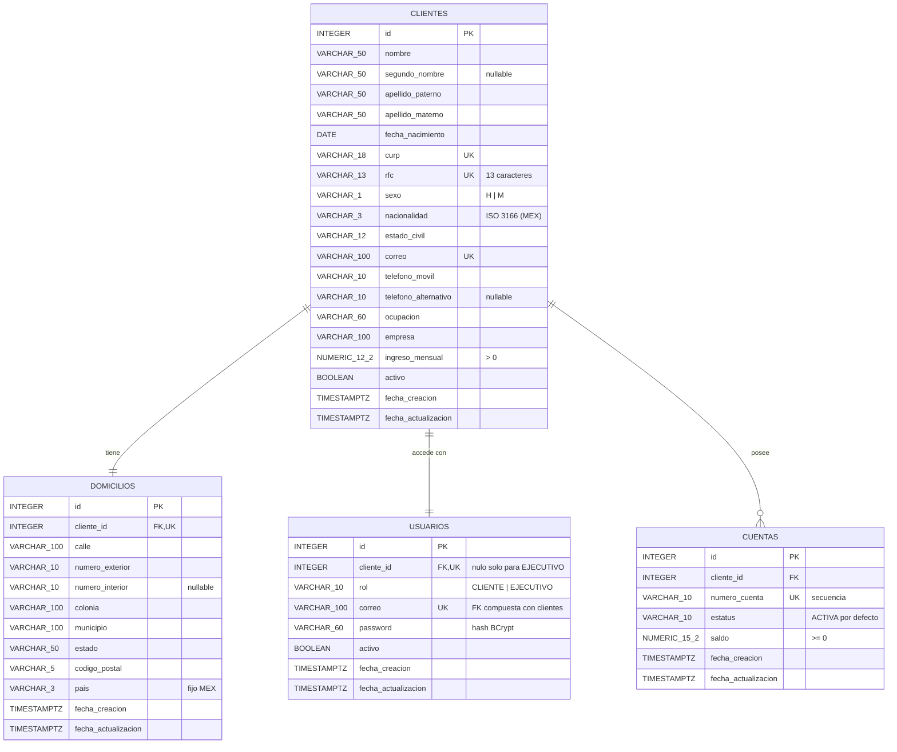

# Onboarding de clientes – Modelo entidad-relación

Esquema `onboarding` (PostgreSQL / Supabase). Script: [V3__crear_esquema_onboarding.sql](../../src/main/resources/db/migration/V3__crear_esquema_onboarding.sql) (migración Flyway).

## Relaciones

| Relación | Cardinalidad | Cómo se garantiza |
|---|---|---|
| Cliente – Domicilio | 1 a 1 | FK `domicilios.cliente_id` + `UNIQUE` |
| Cliente – Usuario | 1 a 1 | FK `usuarios.cliente_id` + `UNIQUE` |
| Cliente – Cuenta | 1 a N | FK `cuentas.cliente_id` (con índice) |

Todas las FK son `ON DELETE RESTRICT`: la baja es lógica (`activo = false`), nunca se borran filas.

## Roles (migración V5)

| Rol | `cliente_id` | Acceso |
|---|---|---|
| `CLIENTE` | obligatorio | Solo sus propios datos y cuentas |
| `EJECUTIVO` | nulo | Administra a todos los clientes, cuentas y usuarios |

`ck_usuarios_rol_cliente` garantiza que un CLIENTE siempre tenga cliente y un EJECUTIVO nunca.
